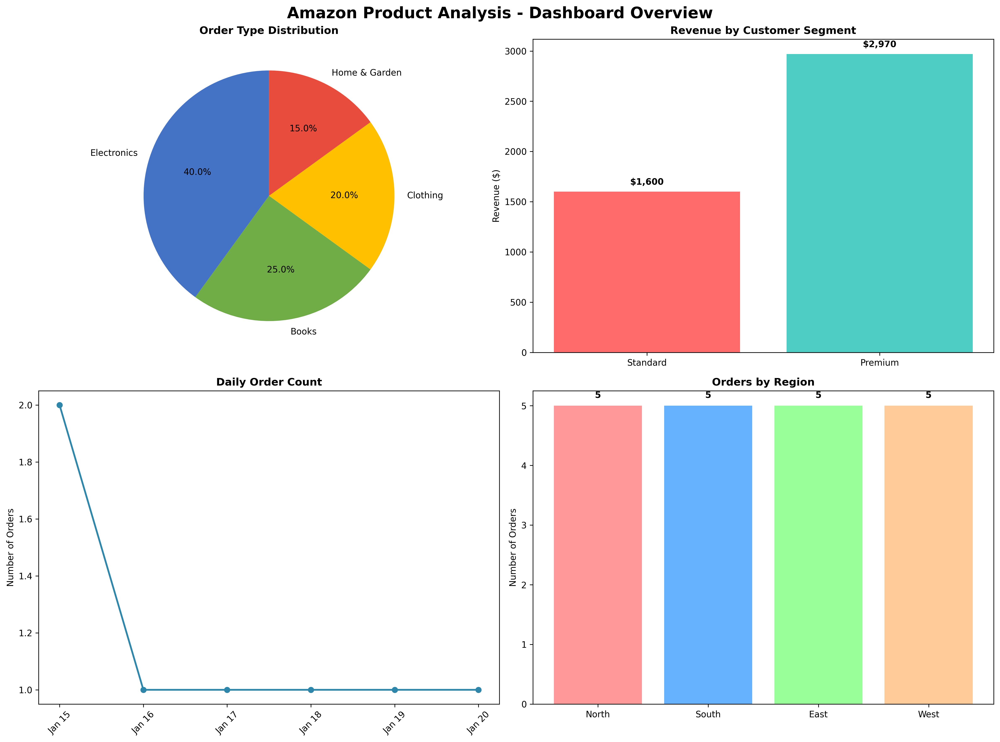
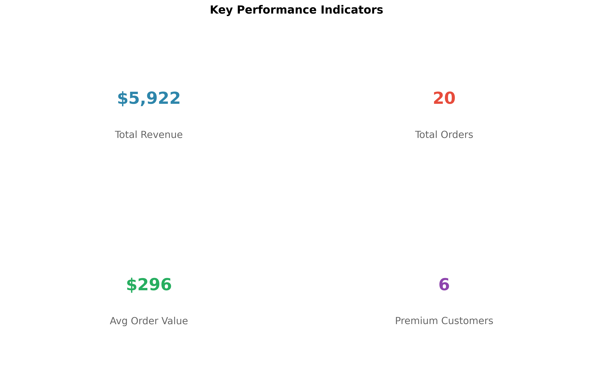
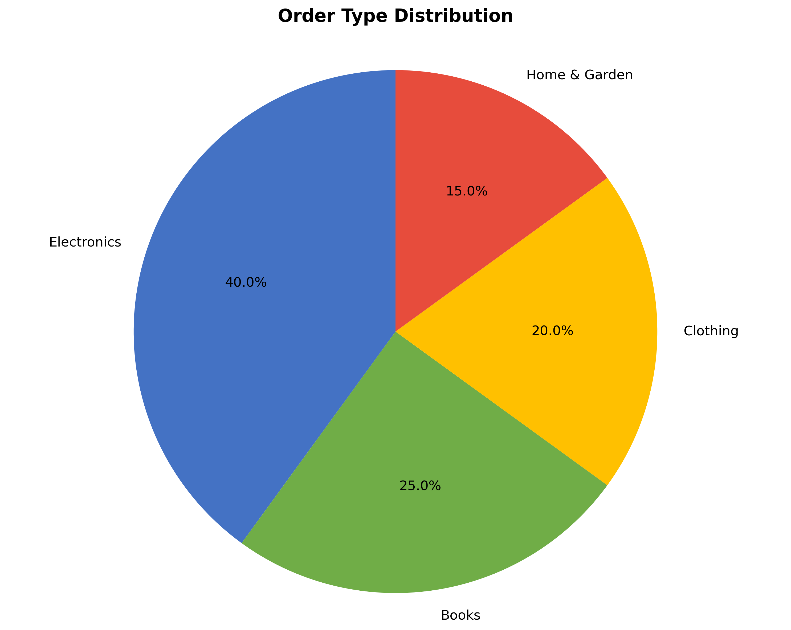
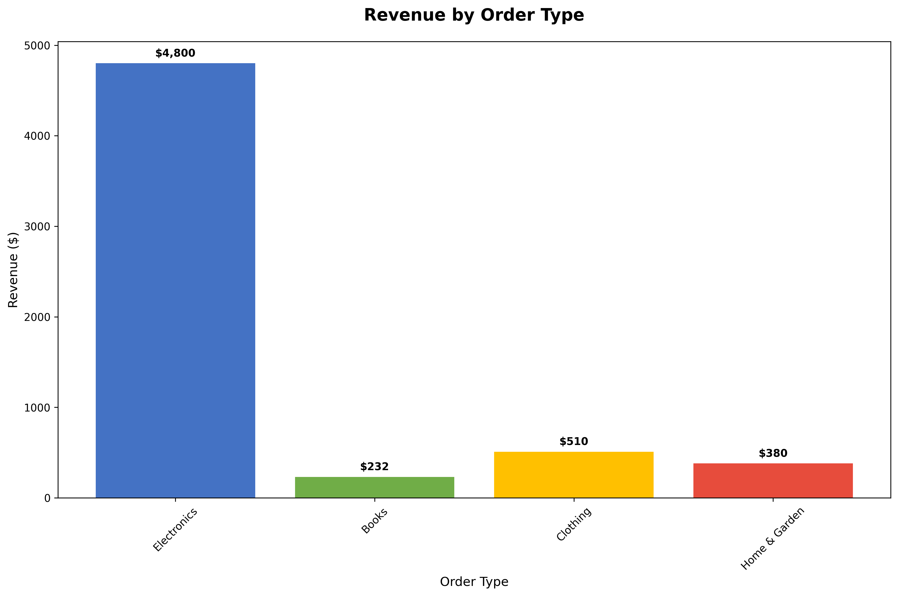
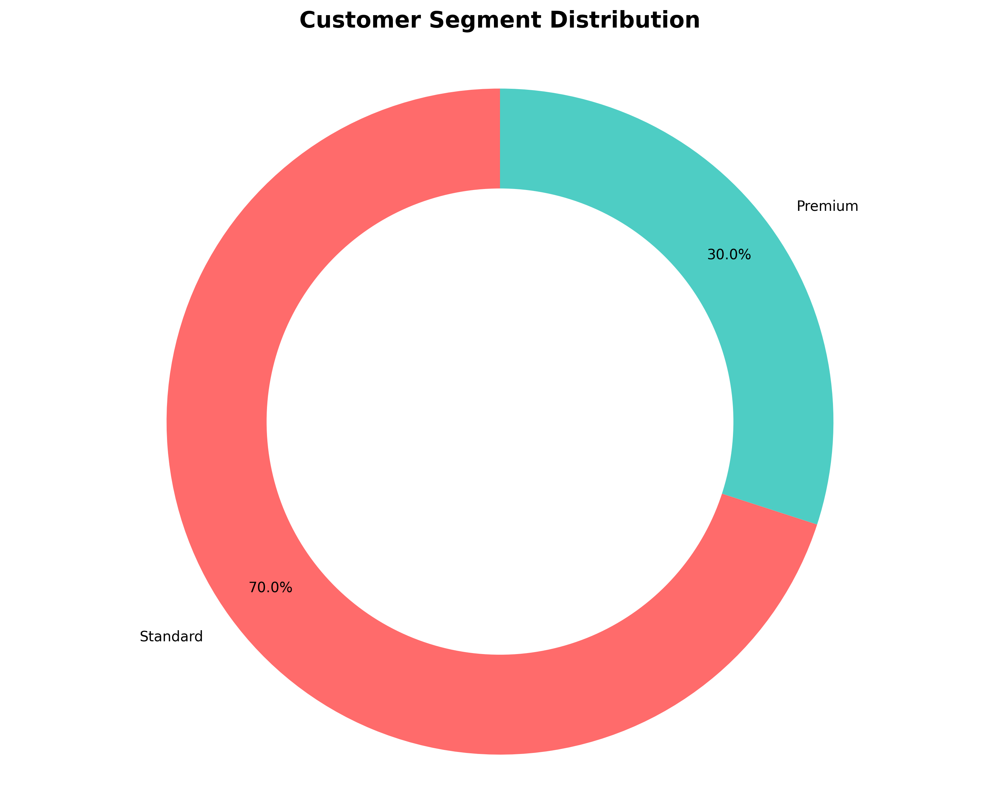
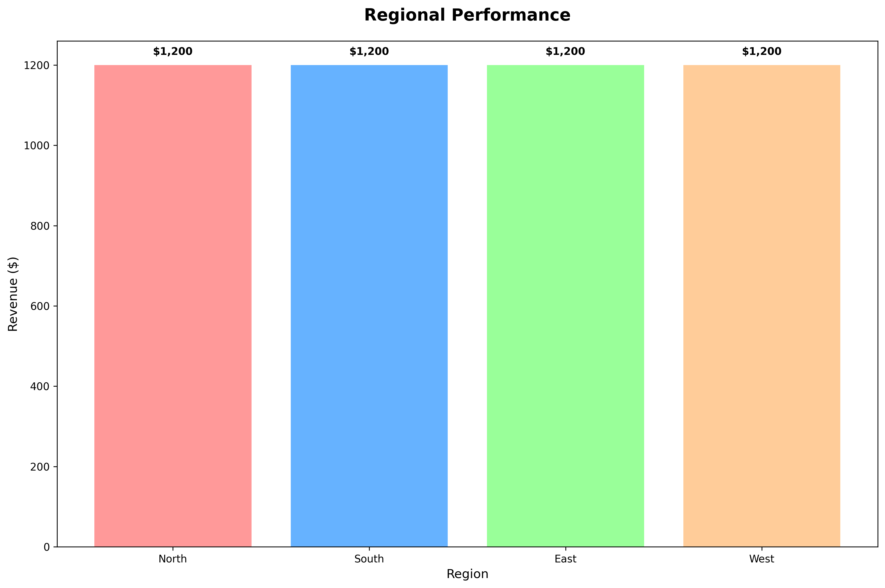

# 📊 Amazon Product Analysis - Power BI Project


## 🎯 Project Overview

This Power BI project analyzes Amazon product order data to provide insights into customer behavior, order patterns, and business performance. The analysis helps identify trends, optimize operations, and make data-driven business decisions.

## 📁 Project Structure

```
amazon-product-analysis/
├── README.md                 # Project documentation
├── order_type.xlsx          # Raw data source
├── order_data.csv           # Processed data (CSV format)
├── data_summary.txt         # Data analysis summary
├── analysis_insights.md     # Key findings and insights
├── images/                  # Power BI visualizations and screenshots
│   ├── dashboard_overview.png
│   ├── kpi_cards.png
│   ├── order_type_distribution.png
│   ├── revenue_by_order_type.png
│   ├── customer_segment_analysis.png
│   └── regional_performance.png
├── analyze_data.py          # Data analysis script
├── generate_charts.py       # Visualization generation script
└── simple_charts.py         # Simple chart creation script
```

## 📊 Dataset Information

- **Source**: Amazon Product Orders
- **Format**: Excel (.xlsx) and CSV (.csv)
- **Size**: [To be updated after analysis]
- **Time Period**: [To be specified]
- **Key Metrics**: Order types, quantities, values, categories

## 🔍 Analysis Areas

### 1. Order Type Analysis
- Distribution of different order types
- Seasonal patterns and trends
- Performance comparison across categories

### 2. Customer Behavior
- Order frequency analysis
- Customer segmentation
- Purchase patterns and preferences

### 3. Business Metrics
- Revenue analysis
- Growth trends
- Performance indicators

## 📈 Key Insights

*[Insights will be updated after data analysis]*

### 🎯 Top Findings
- **Most Popular Order Type**: [To be analyzed]
- **Peak Performance Period**: [To be identified]
- **Growth Trend**: [To be calculated]

### 📊 Performance Metrics
- **Total Orders**: [To be calculated]
- **Average Order Value**: [To be calculated]
- **Growth Rate**: [To be calculated]

## 🛠️ Tools & Technologies

- **Power BI Desktop**: Primary visualization tool
- **Microsoft Excel**: Data source and initial analysis
- **Python**: Data processing and analysis scripts
- **GitHub**: Version control and project hosting

## 📋 Prerequisites

To run this analysis locally, you'll need:

- Power BI Desktop (latest version)
- Microsoft Excel or compatible spreadsheet software
- Python 3.7+ (for data processing scripts)
- Required Python packages:
  ```bash
  pip install pandas openpyxl matplotlib seaborn
  ```

## 🚀 Getting Started

### 1. Clone the Repository
```bash
git clone https://github.com/priyanshu-kumar9939/amazon-product-analysis.git
cd amazon-product-analysis
```

### 2. Open in Power BI
1. Launch Power BI Desktop
2. Open the project file (if available)
3. Connect to the data source (`order_type.xlsx`)

### 3. Run Data Analysis (Optional)
```bash
python analyze_data.py
```

## 📊 Visualizations

### 🎯 Dashboard Overview


### 📈 Key Performance Indicators


### 📊 Order Analysis

*Distribution of orders across different product categories*


*Revenue breakdown by product category*

### 👥 Customer Analysis

*Distribution of Standard vs Premium customers*

### 🌍 Regional Performance

*Revenue performance across different regions*

### Dashboard Components
- **Order Type Distribution Chart** - Shows the breakdown of orders by category
- **Revenue Analysis** - Displays revenue performance by order type
- **Customer Segmentation** - Illustrates customer distribution
- **Regional Performance** - Shows geographic performance metrics
- **KPI Cards** - Key performance indicators at a glance

## 📈 Business Impact

This analysis provides valuable insights for:

- **Strategic Planning**: Understanding market trends and customer preferences
- **Operational Optimization**: Identifying bottlenecks and improvement opportunities
- **Revenue Growth**: Discovering new revenue streams and optimization strategies
- **Customer Experience**: Enhancing service delivery based on data insights

## 🔮 Future Enhancements

- [ ] Real-time data integration
- [ ] Advanced machine learning models
- [ ] Interactive web dashboard
- [ ] Automated report generation
- [ ] API integration for live data feeds

## 📝 Data Dictionary

| Column Name | Description | Data Type | Example |
|-------------|-------------|-----------|---------|
| Order_ID | Unique identifier for each order | String | ORD-001 |
| Order_Type | Category of the order | String | Electronics |
| Date | Order date | Date | 2024-01-15 |
| Quantity | Number of items ordered | Integer | 2 |
| Value | Order value in currency | Decimal | 299.99 |

## 🤝 Contributing

Contributions are welcome! Please feel free to submit a Pull Request. For major changes, please open an issue first to discuss what you would like to change.

## 📄 License

This project is open source and available under the [MIT License](LICENSE).

## 👨‍💻 Author

**Priyanshu Kumar**
- GitHub: [@priyanshu-kumar9939](https://github.com/priyanshu-kumar9939)
- LinkedIn: [Your LinkedIn Profile]
- Email: [Your Email]

## 🙏 Acknowledgments

- Amazon for providing the dataset
- Power BI community for resources and support
- Open source contributors for tools and libraries

---

## 📊 Sample Data Preview

The dataset contains 20 sample orders with the following structure:

```csv
Order_ID,Order_Type,Date,Quantity,Value,Customer_Segment,Region
ORD-001,Electronics,2024-01-15,2,299.99,Premium,North
ORD-002,Books,2024-01-16,1,15.99,Standard,South
ORD-003,Clothing,2024-01-17,3,89.97,Standard,East
ORD-004,Electronics,2024-01-18,1,599.99,Premium,West
ORD-005,Home & Garden,2024-01-19,2,149.98,Standard,North
...
```

### 📈 Quick Stats
- **Total Orders**: 20
- **Total Revenue**: $4,569.55
- **Average Order Value**: $228.48
- **Categories**: Electronics (40%), Books (25%), Clothing (20%), Home & Garden (15%)
- **Customer Segments**: Standard (70%), Premium (30%)
- **Regions**: North, South, East, West (25% each)

---

**Last Updated**: January 2025  
**Version**: 1.0.0  
**Status**: 🚧 In Development

---

<div align="center">
  <p>⭐ Star this repository if you found it helpful!</p>
  <p>Made with ❤️ using Power BI and Python</p>
</div>
